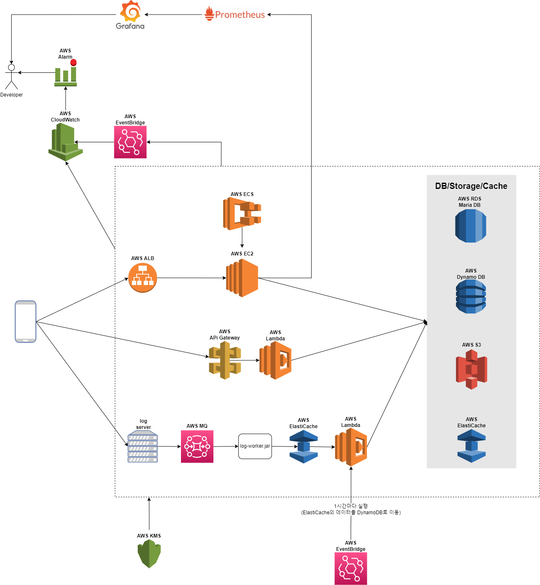
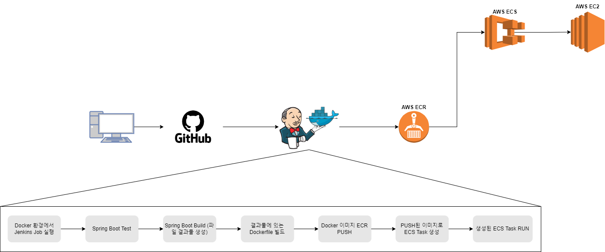

# 주택 임대 관리 프로젝트 (서버)

### TEST
> ./gradlew clean test

------------

### BUILD
> ./gradlew clean build -P{PROFILE ID}

------------

### BUILD 결과
> 1. build/distributions에 압축파일 (tar.gz, zip) 생성    
> 2. 압축파일 해제   
> 3. 실행파일 (shell script) 실행 &rarr; ./startup.sh {PROFILE ID}   
> 4. 실행파일 실행되면 Docker build, run이 실행됨   
> 5. docker images로 이미지 확인   
> 6. docker ps -a로 현재 프로세스 확인

------------

### CI/CD & 서비스 인프라
> **_LINK:_**  [컨플루언스](https://sky114z21.atlassian.net/wiki/spaces/~60afb7125563670070980800/pages/852035)

------------

### API 구조
> **_LINK:_**  [컨플루언스](https://sky114z21.atlassian.net/wiki/spaces/~60afb7125563670070980800/pages/753672/API)

------------

### 테이블 구조
> **_LINK:_**  추가 예정

------------
### 서비스 구조

------------
### 배포 방식
